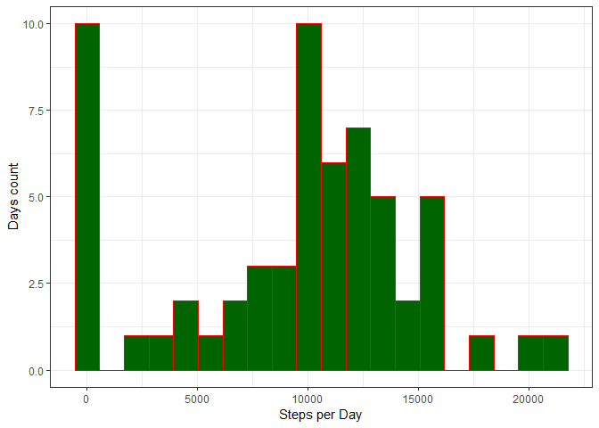

## Loading and preprocessing the data

In this section we load libraries, that will be used later, then load and preprocess the data.

```r
    library(lubridate)
    library(dplyr)
    library(ggplot2)
    data <- read.csv("activity.csv", na.strings = "NA")
    data$date <- ymd(data$date)
```

Let's take a look at the data summary.


```r
    summary(data)
```

```
##      steps             date               interval     
##  Min.   :  0.00   Min.   :2012-10-01   Min.   :   0.0  
##  1st Qu.:  0.00   1st Qu.:2012-10-16   1st Qu.: 588.8  
##  Median :  0.00   Median :2012-10-31   Median :1177.5  
##  Mean   : 37.38   Mean   :2012-10-31   Mean   :1177.5  
##  3rd Qu.: 12.00   3rd Qu.:2012-11-15   3rd Qu.:1766.2  
##  Max.   :806.00   Max.   :2012-11-30   Max.   :2355.0  
##  NA's   :2304
```

Then let's look deeper and answer couple of questions.

## What is mean total number of steps taken per day?

First of all, lets plot histogram of the total number of steps taken each day.

```r
    stepsPerDay <- data %>% group_by(date)%>% summarise(sumSteps = sum(steps, na.rm = TRUE)) 
    qplot(sumSteps, data= stepsPerDay,  bins = 20, xlab = "Steps per Day", 
          ylab = "Days count", fill=I("darkgreen"), col=I("red"))+theme_bw()
```

<!-- -->

Looks like days without steps at all and around 10000 steps it is most frequent days.  
May be the days with 0 steps some how depends on NA data. We invesigate this later.  

Now we take a look at mean 

```r
mean(stepsPerDay$sumSteps)
```

```
## [1] 9354.23
```
and median of total number of steps taken per day.

```r
median(stepsPerDay$sumSteps)
```

```
## [1] 10395
```

## What is the average daily activity pattern?

Let`s see steps activity variation across 24 hours in day

```r
    avgStepsPerInterval <- data %>% group_by(interval) %>% 
                                    summarise(avgSteps = mean(steps, na.rm = TRUE))
    ggplot(avgStepsPerInterval, aes(interval, avgSteps)) + geom_line() + theme_bw() + labs(
        y= "Average steps across all the days", x= "5-minute interval")
```

<!-- -->

and which 5-minute interval, on average across all the days in the dataset, contains the maximum number of steps.

```r
    avgStepsPerInterval$interval[which.max(avgStepsPerInterval$avgSteps)]
```

```
## [1] 835
```

## Imputing missing values

Note that there are a number of days/intervals where there are missing values. The presence of missing days may introduce bias into some calculations or summaries of the data. Lets make some analisys on this.

### Total number of missing values in the dataset 

```r
    sum(is.na(data$steps)); sum(is.na(data$date)); sum(is.na(data$interval))    
```

```
## [1] 2304
```

```
## [1] 0
```

```
## [1] 0
```

### Strategy for filling in all of the missing values in the dataset. 
Looks like we have some NA values for steps variable. Let's impute missing values with mean for that 5-minute interval across all days. And look at new histogramm (dataImp) vs old (data). 

```r
    dataImp <- merge(data, avgStepsPerInterval[which(is.na(data$steps)),], by="interval") %>%
        arrange(date, interval) %>% 
        mutate(steps=if_else(!is.na(steps),steps, as.integer(avgSteps))) %>%
        select(steps, date, interval,avgSteps)

    stepsPerDay <- rbind(
        data %>% group_by(date)%>% summarise(sumSteps = sum(steps, na.rm = TRUE)) %>%
            mutate(dt="data"),
        dataImp %>% group_by(date)%>% summarise(sumSteps = sum(steps, na.rm = TRUE)) %>%
            mutate(dt="dataImp")
    )

    qplot(sumSteps, data= stepsPerDay,  bins = 20, xlab = "Steps per Day", ylab = "Days count",
        fill=I("darkgreen"), col=I("red"), facets = dt ~ .)+theme_bw()
```

<!-- -->

And what about mean and median?

```r
mean(stepsPerDay[stepsPerDay$dt=="dataImp", ]$sumSteps); 
```

```
## [1] 10749.77
```

```r
median(stepsPerDay[stepsPerDay$dt=="dataImp", ]$sumSteps)
```

```
## [1] 10641
```

As you can see we have a difference in the histograms and in the mean and median values of the total daily number of steps. As the impact of imputing missing data we see that mean and median value of the frequency distribution move closer to 11000 steps.


## Are there differences in activity patterns between weekdays and weekends?

Let's create a new factor variable in the dataset with two levels -- "weekday" and "weekend" indicating whether a given date is a weekday or weekend day. We use data set "dataImp" with imputed data.

```r
dataImp <- transform(dataImp, wd = factor(ifelse(wday(date) %in% c(6,7),"weekend","weekday")))
```

And make time series plot of the 5-minute interval (x-axis) and the average number of steps taken, averaged across all weekday days or weekend days (y-axis).

```r
    avgSPIwd <- dataImp %>% group_by(wd, interval) %>% 
                                    summarise(avgSteps = mean(steps, na.rm = TRUE))
    ggplot(avgSPIwd, aes(interval, avgSteps)) + geom_line() + theme_bw() + labs(
        y= "Average steps across all the days", x= "5-minute interval")+facet_grid(. ~ wd)
```

<!-- -->

And look at the same, but in one plot. Better for estimate difference for specific intervals.

```r
    ggplot(avgSPIwd, aes(interval, avgSteps, col=wd)) + geom_line() + theme_bw() + labs(
        y= "Average steps across all the days", x= "5-minute interval")
```

<!-- -->

We see that peak intervals dominate at weekends, but at weekdays mornings people take more activity razer then weekends. 
